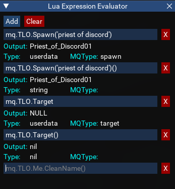
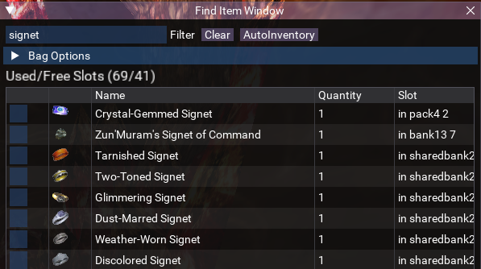
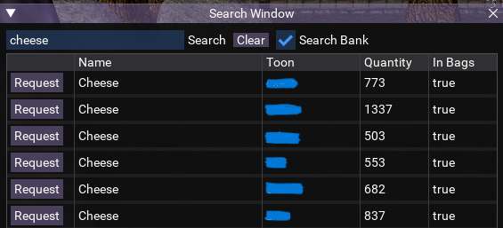
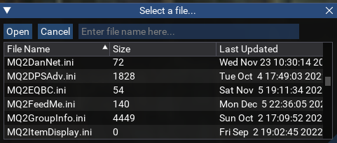
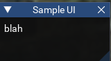

# misclua

Random lua scripts

# atenslience

Run on all characters.  
Will run non-MA characters to the door when green circle silence happens if the MA is targeted.
Will run targeted character to the  door when green circle silence happens if targeted character is not the MA.
Beeps meanly at you if no MA is set.
Ends when Aten Ha Ra dies.

# sheiroot

Run on cleric or shaman only.
Will set CWTN plugin BYOS on and for shaman also memcureall on.
Mems blood of mayong in gem 6 for shaman and shackle in gem 13 for both cleric and shaman.
Casts shackle on any red alien spawns.
Casts cures on any targeted character in the group. Curing is handled by the script since the plugin won't cure other peoples characters.

# eval

Like the macro expression evaluator, but for displaying lua parse values. I don't recommend running this code as its got deprecated, insecure calls being used, like `loadstring`.



# find

Like the find item window from live, but for emu since it doesn't have one. It will error if you put funny characters in the filter that are also string pattern characters like `[`. It only shows items in bags, inventory slots, bank and shared bank. It doesn't show augs in items.



# search

A UI for searching for items across your DanNet peers



# ImGuiFileDialog

A Lua implementation of a file picker dialog for use by scripts which want to be able to select a file from a folder.

See `lfssample.lua` for example usage.



# uisample

A very simplistic UI script to just create a single empty ImGui window.



# Lootutils

A Lua port of NinjAdvLoot.inc. It handles looting, selling and banking tradeskill items using the same INI configuration as the macro include did.

Some settings were ported over from the old include, some not. I only kept working on the script until it was far enough along for my own purposes.

Usage:

```lua
local loot = require('lootutils.lua')

-- main loop of your own script
while true do
  loot.lootMobs()
end
```

```lua
local do_sell = false

-- bind callback for your script, accepting a 'sell' command like '/myscript sell'
local function cmd_callback(command)
  if command == 'sell' then
    do_sell = true
  end
end

-- main loop of your own script
while true do
  if do_sell then loot.sellStuff() end
end
```

The script can also be run standalone with a loop, or as a run once and exit.

More details are provided in the script.

# Lua Timer Library

Provides a simple timer implementation.

Usage:

```lua
local mq = require('mq')
local timer = require('timer')

local myTimer = timer:new(5)
-- Start time defaults to 0 rather than current time, so timers start expired
-- Why? Just because I guess.
myTimer:reset()

print(os.time())
while not myTimer:timer_expired() do
  mq.delay(1000)
end
print(os.time())

print('Waited 5 seconds until myTimer expired')
```

# Lua Cache Library

A very poor implementation of a cache. I don't recommend using this.
